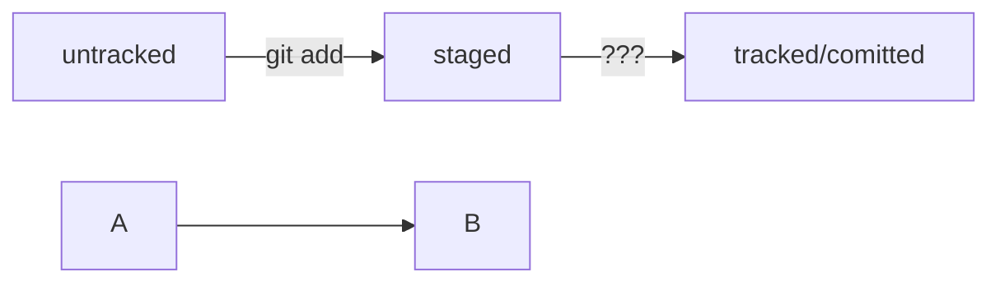

# Команды Git!!!

git init сделать папку репозиторием
git remote -v

## Сделать папку репозиторием
```
$ git init # создать репозиторий
```

## «Разгитить» папку, если что-то пошло не так

Если вы случайно сделали Git-репозиторием не ту папку, её можно «разгитить». Для этого нужно удалить скрытую подпапку .git.
Если удалить .git, то вся история проекта будет стёрта без возможности восстановления — останется только последняя версия файлов.

```
$ rm -rf .git # удалить подпапку .git 
```
Ключи:
* -r - удалить папки вместе с их содержимым;<br>
* -f - без подтверждения удаления.

## Проверить состояние репозитория 
```
$ git status # текущее состояние репозитория
```

Команда git status выведет:
* название текущей ветки: On branch master или On branch main;
* сообщение о том, что в репозитории ещё нет коммитов: No commits yet;
* сообщение, которое говорит: «чтобы что-нибудь закоммитить (то есть зафиксировать), нужно сначала это создать» — nothing to commit (create/copy files and use "git add" to track);
* untracked значит, что Git ещё не хранит информацию о версиях файла и не может отследить, как он изменялся.

git status показывает только следующие состояния файлов:
* staged (Changes to be committed в выводе git status);
* modified (Changes not staged for commit);
* untracked (Untracked files).


Cтатусы:
* untracked - неотслеживаемые файлы. У untracked-файла нет предыдущих версий, зафиксированных в коммитах или через команду git add.
(помечается файл, о существовании которого Git знает, но не следит за изменениями в нём)
* staged - файл, который войдет в коммит (Файл переходит в статус staged после выполнения git add.)
* modified - есть изменения в файле
* tracked - отслеживаемые файлы




## Добавить файлы в репозиторий
Команда git add не сохраняет содержимое файлов в репозитории. Само сохранение, или фиксацию состояния файлов, называют коммитом (от англ. commit — «совершать», «фиксировать»). «Сделать коммит» значит сохранить текущую версию файла. 
```
$ git add filename # подготовить файл к сохранению
$ git add --all # подготовить к сохранению все файлы в репозитории
$ git add . # добавить всю текущую папку
```
## Выполнить unstage изменений
Допустим, вы создали или изменили какой-то файл и добавили его в список «на коммит» (staging area) с помощью git add, 
но потом передумали включать его туда. Убрать файл из staging поможет команда git restore --staged <file> (от англ. restore — «восстановить»).

```
git restore --staged <file>

git restore --staged . # сбросить всю текущую папку
```

## Выполнить коммит

Сделать коммит можно командой git commit c ключом -m (от англ. message — «сообщение»), который присваивает коммиту сообщение.
Сначала команда git add сообщает Git, какие именно файлы нужно сохранить и какую их версию. Затем с помощью команды git commit происходит само сохранение. 
```
$ git commit -m 'Мой первый коммит!' 
```

Сообщение не должно быть длиннее 72 символов, первое слово - глагол в инфинитиве (исправить, дополнить, добавить)
Пример,  git commit -m "LGS-239: Дополнить список пасхалок новыми числами"

Conventional Commits предлагает такой формат коммита: <type>: <сообщение>.
Первая часть type — это тип изменений. Таких типов достаточно много. Вот два примера:
feat (сокращение от англ. feature) — для новой функциональности;
fix (от англ. «исправить», «устранить») — для исправленных ошибок.

GitHub-стиль 
git commit -m "Исправить #334, добавить график температуры" 
  
## Исправить коммит

С опцией --amend команда commit не создаст новый коммит, а дополнит последний.
```
git commit --amend --no-edit
```

## Изменить сообщение коммита
Если нужно изменить только сообщение
Измениь можно только последний коммит
```
git commit --amend -m "Новое сообщение"
```

## Откатить коммит
```
git reset --hard <commit hash>
```

## «Откатить» изменения, которые не попали ни в staging, ни в коммит
```
git restore <file>
```


## Просмотреть историю коммитов
```
$ git log # просмотреть историю коммитов в обратном хронологическом порядке — 
	  # последние коммиты оказываются первыми сверху
```
Элементы, из которых состоит описание:
* строка из цифр и латинских букв после слова commit — это хеш коммита;
* Author — имя автора и его электронная почта;
* Date — дата и время создания коммита;
* в конце находится сообщение коммита.

```
$ git log --oneline # получить сокращённый лог 
```
Обратите внимание: если выход из просмотра логов не произошёл автоматически, 
нажмите клавишу Q (от англ. Quit — «выйти») в английской раскладке клавиатуры.

Таблица соответствия хеш → информация о коммите хранится в папке .git
Основной идентификатор коммита — это его хеш.  
Если вы знаете хеш, вы можете узнать всё остальное: автора и дату коммита и содержимое закоммиченных файлов.
Если хеш получить дважды для одного и того же набора входных данных, то результат будет гарантированно одинаковый.

### HEAD
Cлужебный файл HEAD в папке .git.
Это файл в папке .git, в котором записана ссылка (или ссылка на ссылку) на последний коммит.
Это синоним хеша последнего коммита — его можно передавать командам Git в качестве параметра.

## Привязать удалённый репозиторий к локальному
```
$ git remote add origin git@github.com:%ИМЯ_АККАУНТА%/%имя проекта%.git 
```
Команде необходимо передать два параметра: имя удалённого репозитория и его URL. 
В качестве имени используйте слово origin. А URL скопируйте со страницы удалённого репозитория.

## Убедиться, что репозитории связаны
```
$ git remote -v
```

## Отправить изменения на удалённый репозиторий &&&&&!!!!!
```
$ git push -u origin main # выдается при первом обращении. 
			  # Если команда приведёт к ошибке, попробуйте 
                          # заменить main на master. 
$ git push # при последующих выдачах команд
```


